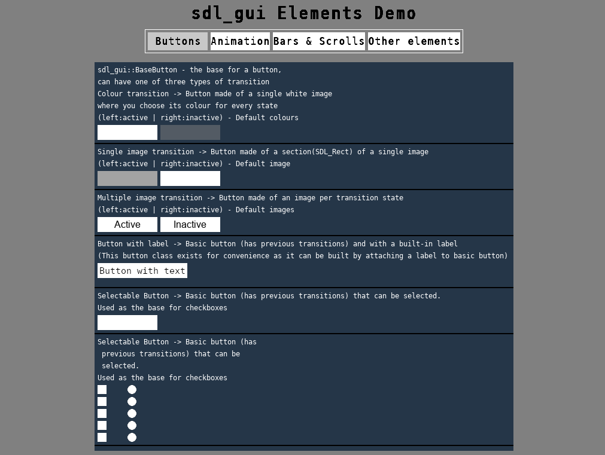

# sdl_gui project

When creating my projects I always had problems with my GUIs (still do, I am bad at making them), when I started a new project, I could never, easily, move the old gui to it so I ended up making new ones (before you ask I did not want to use an external gui, I wanted to keep dependencies to the minimum, usually SDL2 only).
As I like to learn how things work, I started making my own little gui lib inside my [generic project](https://github.com/N4G170/generic).

Through time, this gui suffered 2 complete redesigns, the first moved from the original mishmash of classes, files, rules, and more, into a cleaner hierarchical structure,
but after a while I noticed the errors of my approach, so ... redesign. In the second and current redesign, the hierarchical structure was simplified and managers were added.
The current version is easy to use and somewhat clean, it has its problems, like the amount of work needed to add a new element to the gui.

When creating a demo showcase for the elements in gui, inside the [generic project](https://github.com/N4G170/generic), I decided to remove the gui from it and create a new separated project for it, a so was born 'sdl_gui'.

After porting the gui to this project, I started making a new demo showcase.

When making this demo, I noticed that some actions could be simplified or eliminated altogether, then I started thinking how to improve it further.
And so my Entity-Component-System (ECS) system was born, in the [generic project](https://github.com/N4G170/generic) (I usually jump between my project when I have new ideas).
The new ECS system is similar(on a smaller scale) to how unity3d objects and components are created and managed.

I really enjoy working on this project, it made me look differently to GUIs, they are more complicated than I thought. My favourite part was working with utf8 and creating the font sheet texture, for easier use of text (as sdl ttf rendering in not the best).

###### Existing elements.
Currently sdl_gui has the following elements (present in demo):
- BaseButton: Basic button that can use colour or images as transition (active/inactive/over/pressed)
- BasicFrameAnimation: basic animation that uses images (one per frame, or one divided in areas)
- Colliders: mainly used with the buttons to check is the mouse is over it or not
- Button: Specialization of the BaseButton but can have a label(this one show the over-complication of adding a new element to a new one)
- Camera: gui elements outside the camera area are not rendered
- Checkbox: Can be simple or radio, and can be grouped (radio functionality only works in groups)
- sliders: both horizontal and vertical sliders
- Image: basic image to be rendered, used by the other elements, but not in the cleanest way
- Label: The one I enjoyed making the most (mainly because of the issues with the font), it supports some formatting like:
  - Bold: <b\> </b\>
  - Italic: <i\> </i\>
  - New line: \\n
  - Tab: \\t
- Layout: basic structure used to arrange(grid, line, column,...) all elements that it is the parent of.
- ProgressBar: like a loading bar, can be horizontal or vertical
- ScrollBox: this one is a bit incomplete, it basically is a list of labels with a scrollbar
- SelectableButton: similar to a checkbox but is a basic button
- Textbox: Basic input box, very limited (I stop working on it when I started working on the ECS, as to not waste time)
- Tooltip: Mouse over and hold over the tooltip detect area to show tooltip
- ScrollBar: Vertical only

All the previous elements function on top of:
- Resource manager: manages images and fonts
- Gui manager: holds the elements and calls theirs main functions, like Render, Input, Logic
- MouseInteraction: mainly on the buttons, checks if the mouse is over the element or not and if there were clicks, then calls the appropriate callback
- Transform: each element has one, it holds the position, size and parent-children relations of the element. (the new transform from the ECS is better than this one)  

Some of this elements have problems that will be solved when I move to my ECS system.

### Screenshots

Demo program, buttons tab


Demo program, bars tab

## Running the program
You can download the latest release from the release tab ([link](https://github.com/N4G170/sdl_gui/releases)) or you can build it yourself.

The provided builds have a demo showcasing the elements present on the project. Use the buttons on the top to change panels and try the elements.

## Building

### If on Linux

First install all the dependencies:
- SDL2
- SDL2_image
- SDL2_ttf
- cmake

After that, open terminal window at the base of the project (the folder with this file) and run the commands:

```
- mkdir build
- cd build
- cmake ..
- make -j
```
If no errors appear, the build is complete inside the "bin" folder and you can run the program with the command ./demo_sdl_gui in your terminal (you can only run it from the terminal).

Inside the "lib" folder you have the "sdl_gui" static lib and include files for easy use in other projects.

NOTE: As cmake creates the executable as a shared object (I have yet to find why), you have to run the program through the terminal, rather than double click.

### On windows

Note: On windows I only tested using Visual Studio 2017 (you can use whatever you want as long as it supports cpp14 and is 64bit).

On windows you need to download [cmake](https://cmake.org/) and use it to create a "vs 15 2017 64bit" solution (needs to be 64bit).
To use cmake, create a "build" folder and set it as build folder. Set the root of the project as the source folder and run it. Inside the build folder will be a vs solution.
Open the solution, set it to release (64bit) and build it. The final build and all needed dlls and the data folder will be inside the "bin/release" folder.

Inside the "lib" folder you have the "sdl_gui" static lib and include files for easy use in other projects.

## TODO

As I said before, I'll move the project to the new ECS system and make it ready for correct .lib/.dll creation on windows.
After the new system in implemented, I'll correct and finish the existing elements.

If you find any bug of error, let me know.
